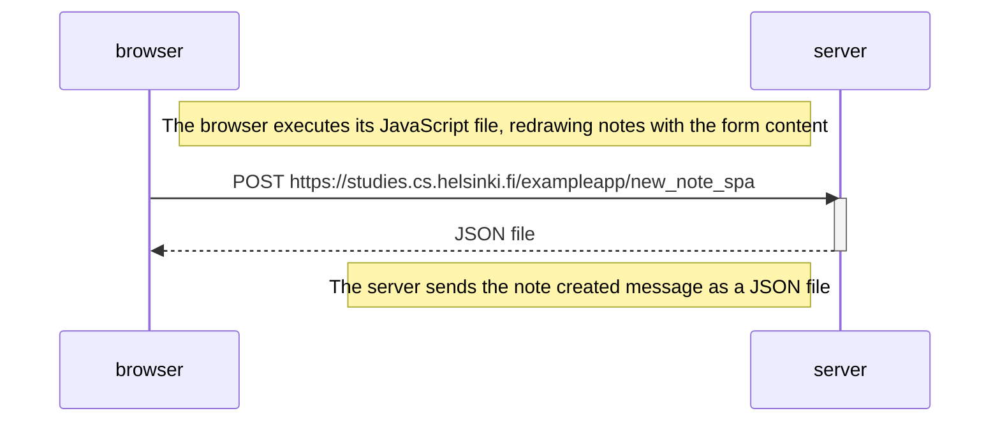

```mermaid
sequenceDiagram
    participant browser
    participant server
    note right of browser: The browser executes its JavaScript file, redrawing notes with the form content 
    browser->>server: POST https://studies.cs.helsinki.fi/exampleapp/new_note_spa
    
    activate server
    server-->>browser: JSON file
    deactivate server
     Note left of server: The server sends the note created message as a JSON file
```